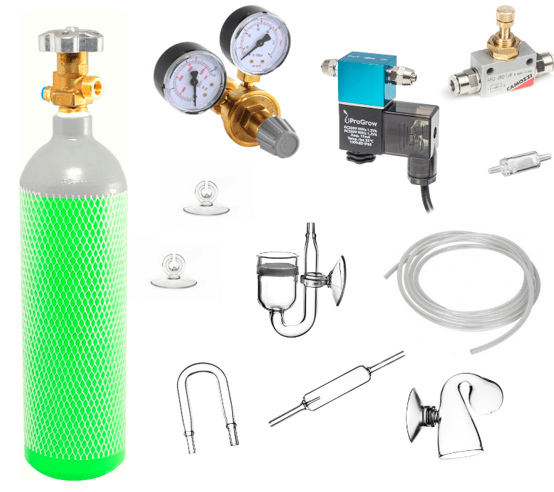
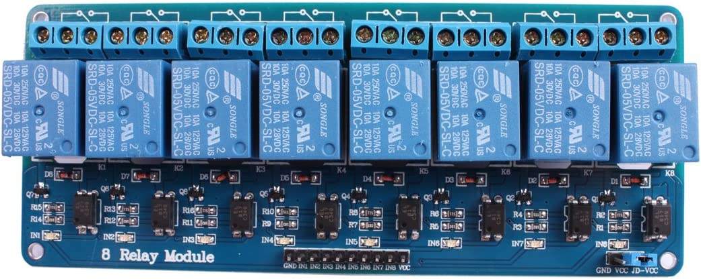
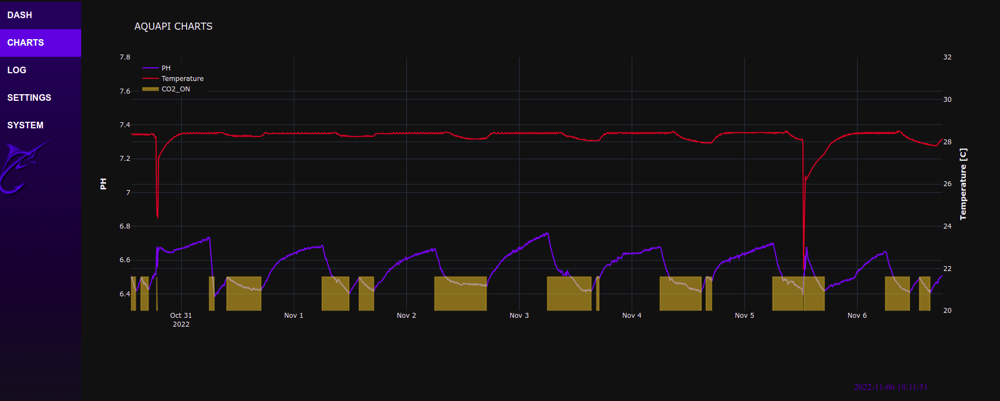

# AQUAPI2

## Aquarium controller based on RaspberryPi Zero2 and Arduino. 
The controller supports: 

* PH control with use of <a href=https://botland.store/gravity-temperature-sensors/5874-dfrobot-gravity-ph-analog-sensormeter-5903351243513.html>DFORBOT PROBE</a>
and CO2 injection system equipped with CO2 electric valve
 

* Temperature reading with DS12B20 digital thermometer sensor [<a href="https://www.circuitbasics.com/raspberry-pi-ds18b20-temperature-sensor-tutorial/">how to</a>] or any analog thermometer accessible via Arduino board

* Control devices and lighting with 8 channel Relay

## Other components and software

* Arduino MINI PRO

* Arduino ISP programming done with RaspberryPI [<a href="https://learn.adafruit.com/program-an-avr-or-arduino-using-raspberry-pi-gpio-pins">Adafruit manual</a>]

* Plotly library <a href="https://plotly.com/python/">PLOTLY</a>

* Circuit designed in Eagle [Version 0]

