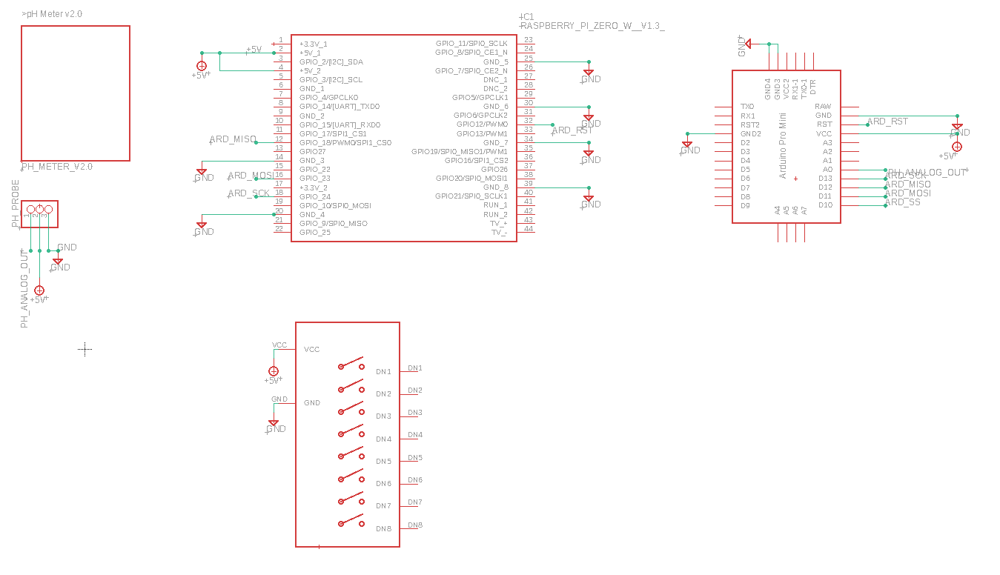

# AQUAPI2

Aquarium controller based on RaspberryPi and Arduino. 
The controller supports: 

* PH control with use of <a href=https://botland.store/gravity-temperature-sensors/5874-dfrobot-gravity-ph-analog-sensormeter-5903351243513.html>DFORBOT PROBE</a>
 

* DS12B20 digital thermometer sensor [<a href="https://www.circuitbasics.com/raspberry-pi-ds18b20-temperature-sensor-tutorial/">how to</a>]

* Arduino MINI PRO to work with PH Proble

* Arduino ISP programming done with RaspberryPI [<a href="https://learn.adafruit.com/program-an-avr-or-arduino-using-raspberry-pi-gpio-pins">Adafruit manual</a>]

* Circuit designed in Eagle

